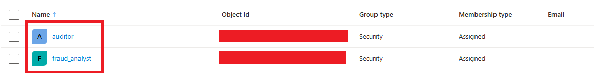
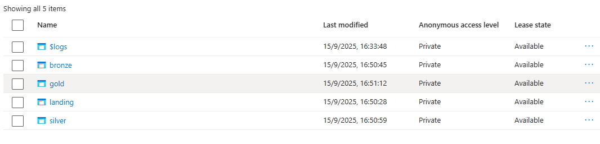
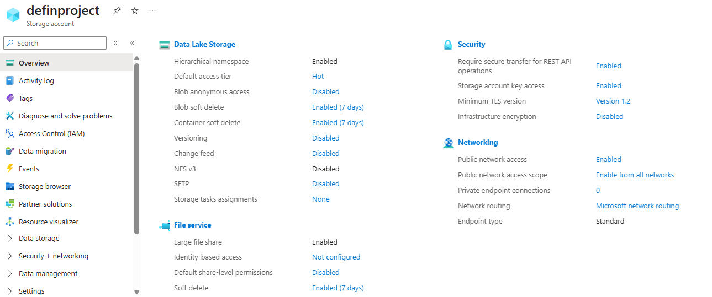
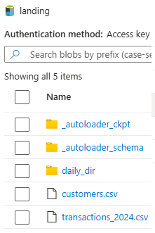
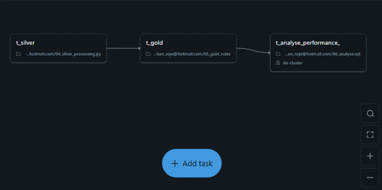
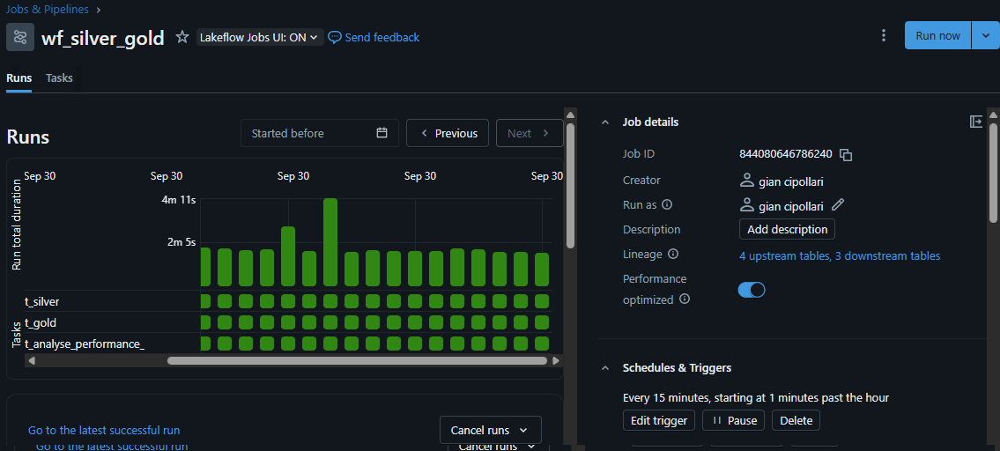
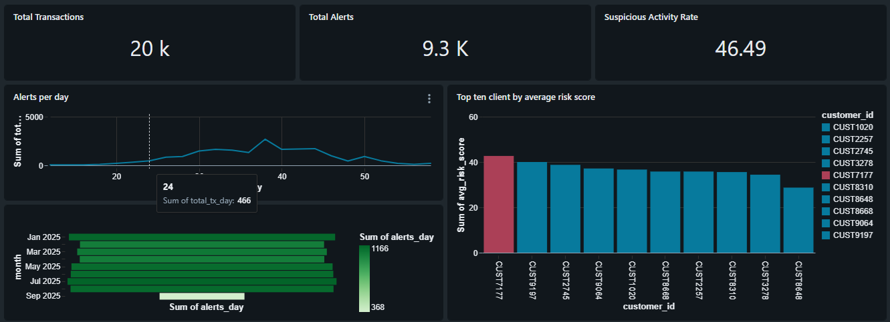

# Fraud Analysis with Azure Databricks

This project simulates a **financial fraud detection pipeline** implemented with **Azure Databricks**, **ADLS Gen2**, and **Unity Catalog**, following the **Medallion Architecture** (Landing > Bronze > Silver > Gold).

Data is ingested from raw CSVs, transformed with PySpark, and enriched with business rules to compute a fraud risk score.\
The goal is to demonstrate an end-to-end data engineering and analytics process from raw ingestion to automated job orchestration and dashboard visualization.

##  Environment Setup and Security

### 1. Azure Entra ID and Resource Configuration

The project begins with the creation of an **Azure Subscription** and a **Resource Group**, within which identity management and access control were configured using **Microsoft Entra ID**. In this environment, users and groups were established to define different levels of access. The `fraud_analyst` group was granted full privileges over the Gold datasets, while the `auditor` group was limited to read-only permissions. All roles and access levels were managed and granted through Unity Catalog by executing SQL commands such as `GRANT` and `REVOKE`, ensuring a secure and organized governance model for data usage.




---

### 2. Storage Account and ADLS Gen2 Containers

A **Storage Account** named `definproject` was created with **Hierarchical Namespace (HNS)** enabled to support **ADLS Gen2**.\
The following containers were created to represent the Medallion layers:

```
landing/
bronze/
silver/
gold/
ref/
```

Each layer represents a different stage in the data refinement process. The **ref/** layer serves as a reference schema used to store lookup or auxiliary tables that can be joined with transactional data in downstream layers.





##  Data Architecture (Medallion Model)

The project follows the **Medallion Architecture**, a best practice in Databricks for organizing data pipelines:

| Layer       | Description                                            | Notebook                                                           |
| ----------- | ------------------------------------------------------ | ------------------------------------------------------------------ |
| **Landing** | Raw files ingested from transactional sources.         | -                                                                  |
| **Bronze**  | Basic cleaning and schema alignment.                   | 01_ingest_bronze.ipynb       |
| **Silver**  | Filtered and enriched data with normalized columns.    | 02_bronze_to_silver |
| **Gold**    | Final analytical tables for dashboards and monitoring. | 05_gold_rules.ipynb           |

 *Screenshot:* (to be added once `architecture.png` is finalized)


## Data Pipeline and Notebooks

### 1. Ingestion and Bronze Layer

The notebook *01_ingest_bronze.ipynb* reads raw transaction files from `landing/` and writes them into the **Bronze** Delta tables.\
This includes:

- Loading CSVs from ADLS.
- Defining schema and applying minimal transformations.
- Writing Delta tables into the `finance_catalog.bronze` schema.

---

### 2. Silver Layer Processing

*02_bronze_to_silver.ipynb* performs data validation and cleaning:

- Removes nulls and invalid amounts.
- Normalizes categorical fields (country, merchant, currency).
- Saves clean data to `finance_catalog.silver.transactions`.


---

### 3. Stream Ingestion Simulation

*03_ingest_stream.ipynb* demonstrates **streaming ingestion** using small CSV partitions from the `data/transactions_daily` folder to simulate incremental updates. The ingestion process leverages the **Databricks Autoloader**, which automatically detects new files arriving in the source directory and loads them efficiently into Delta tables. This allows the pipeline to handle near real-time data updates with scalability and minimal latency.



---

### 4. Silver-to-Gold Transformation

*04_silver_processing.py.ipynb* aggregates and enriches transactions for analysis.

*05_gold_rules.ipynb* applies business rules to detect potential fraud based on thresholds, unusual locations, and transaction frequency.

06\_analise.sql.ipynb is used to automatically imrpove the performance of the queries and cost optimization.

📸 *Screenshot:* `job_silver_processing_1.png`

---

## Automation and Orchestration

Two JSON configuration files define the orchestration and job scheduling:

| File                         | Description                                                  |
| ---------------------------- | ------------------------------------------------------------ |
| `Job_silver_processing.json` | Configuration for the Silver-to-Gold processing job.         |
| `wf_silver_gold.json`        | Workflow for automating the entire Silver and Gold pipeline. |







---

## Security and Governance with Unity Catalog

*07_uc_grants.ipynb* applies the **Unity Catalog** permission model:

- Grants selective `USAGE` and `SELECT` privileges to specific users.
- Revokes unnecessary privileges for auditors to comply with governance principles.


---

## Fraud Monitoring Dashboard

The final step was building an interactive **Databricks SQL Dashboard**, `Fraud_Monitoring_Dashboard`, showing key performance indicators:

- **Total Transactions**
- **Total Alerts**
- **Suspicious Activity Rate**
- **Top 10 clients by risk score**
- **Alerts per day and per month**



---

##  Tools and Technologies

- **Azure Databricks (SQL & Notebooks)**
- **Azure Data Lake Storage Gen2**
- **Pyspark**
- **Unity Catalog**
- **Databricks SQL Warehouse**
- **Delta Tables / Delta Lake**
- **Microsoft Entra ID**
- **JSON for Job Configuration**

##Thank you for reaching here, I hope that something from this repository may help you.
Mail : gianfrancocipollari@gmail.com 
